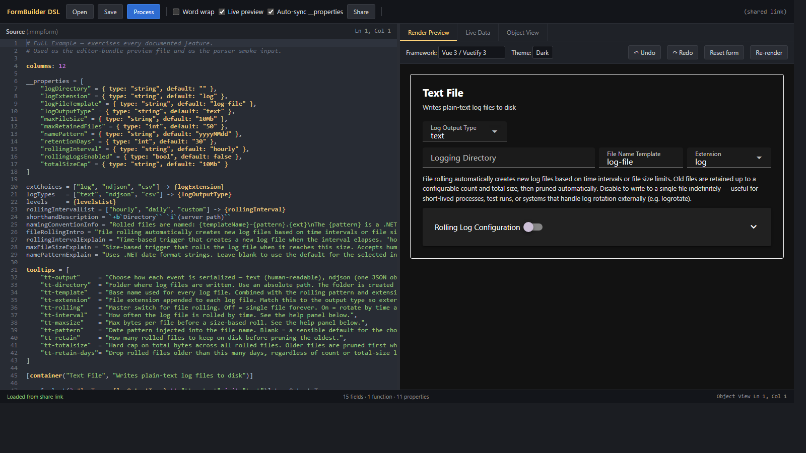

# FormBuilderDSL

[](https://www.npmjs.com/package/@mmpworks/formbuilder-dsl)
[](https://github.com/smuchow1962/FormBuilderDSL/actions/workflows/ci.yml)
[](https://codecov.io/gh/smuchow1962/FormBuilderDSL)
[](./LICENSE)

**A platform-agnostic dynamic page builder.** Write a small text file
that describes a form (labels, fields, dropdowns, visibility rules,
layout) and FormBuilderDSL parses it into a stable AST your host app
maps to real UI in whatever stack you already use.

- **No built-in widgets.** The package parses and validates. Your
  code maps each control type to a real component (React, Vue,
  Blazor, plain HTML, a desktop host, whatever you already use).
- **Typed and ESM-first.** Ships `types/index.d.ts` and ECMAScript
  modules (`"type": "module"`), with subpath imports for the helper
  surfaces.
- **Safe errors.** Failures return a small result object with a
  numeric code and messages, not just thrown exceptions.

The same parsed AST can feed a public portal, an internal ops
console, and a partner-facing tool. One definition, many surfaces.



## What this solves

Regulated and line-of-business software keeps running into the same
shape of problem: long workflows, conditional fields, curated
dropdowns, and layouts that must stay reviewable and consistent
across channels.

- **Banking and treasury.** Product parameters, limits, and
  eligibility rules that change with jurisdiction or client tier.
- **Healthcare and life sciences.** Protocols, consent steps, and
  instrument or study settings with disclosure rules and tooltips
  for safety copy.
- **CRM and operations.** Entity layouts, integration credentials,
  and admin screens that differ per tenant but share one engine.
- **Scientific and industrial.** Run configs, batch parameters, and
  equipment profiles where operators need guardrails, not free-form
  JSON.

The **definition** stays in portable text; the **presentation**
stays in whatever UI stack you already use. You stop hand-
maintaining parallel forms in every host.

## Why this matters

- **Product teams** keep page definitions portable across stacks;
  swap renderers without rewriting the DSL.
- **Operators and integrators** get predictable forms instead of ad
  hoc JSON blobs.
- **Developers** separate *what the form is* (DSL → AST) from *how
  it draws*, so host UI refactors don't force grammar changes.
- **Quality** benefits from parse-time checks (layout sums, unknown
  types, bad refs) with source diagnostics. Grammar and reference
  errors carry both line and column; layout-sum errors carry the
  row's line (the column is the whole row).

## Example use case

A bank employee setting up a **new business client** picks a
**product type** from a dropdown, types a **dollar limit** for
account size, and answers two yes/no questions. **Extra questions**
about screening and currency hedging only appear when those answers
mean the bank needs more detail. Not for every client.

That pattern, "show the right fields at the right time," is one text
file. Anyone can read it; your app turns it into the real form.

A worked sample (lists, fields, and a `when=`-gated optional
section):

```dsl
columns: 20

productFamilies = ["Treasury", "Trade Finance", "Liquidity Services"] -> {productFamily}
riskTiers       = ["Standard", "Elevated", "High touch"] -> {riskTier}
fxRoutes        = ["Sales desk", "Treasury MM", "External broker"] -> {fxDisclosureRoute}

tooltips = [
  "exposure" = "How large the account can grow before extra approval is required."
]

[container({taskTitle},{clientSummary})]

  - [select(5,#productFamilies,{productFamily})] Product family
    | [select(5,#riskTiers,{riskTier})] Risk tier

  - [number(10,{dailyLimitUsd},min=0,step=100000,tt="exposure")] Daily exposure limit (USD)

  - [toggle(4,{nonDomestic})] Non-domestic entity
    | [toggle(4,{highExposure})] Above policy threshold

  - [>container(panels=[1:10,2:10],when="nonDomestic || highExposure")] [label(4,style=note)] Jurisdiction review

    1. Sanctions & screening
      - [textfield(10,{sanctionsRef})] Screening case reference
      - [check(3,{eddComplete})] EDD package complete

    2. FX & hedging
      - [select(5,#fxRoutes,{fxDisclosureRoute})] Disclosure route
      - [textfield(10,{traderBookId})] Trading book ID
```

A bigger sample with more controls and tabs is in the GitHub repo at
[`editor/samples/full-example.mmpform`](https://github.com/smuchow1962/FormBuilderDSL/blob/main/editor/samples/full-example.mmpform).

## Key features

- Bracketed control declarations with marker-based parameters
  (`width`, `#optionSource`, `{binding}`, `key=value`).
- **Control-spec registry** decouples grammar from vocabulary. New
  control types are data, not parser forks.
- **Versioned AST** as the contract for renderers and tools.
- **`when=` expressions** for conditional visibility; tooltips,
  colors, and text decorators for rich labels.
- **Editor bundle** (TextMate / VS Code-style) for `.mmpform`
  syntax coloring. See the
  [`editor/` directory on GitHub](https://github.com/smuchow1962/FormBuilderDSL/tree/main/editor).

## Architecture in one paragraph

**DSL text → tokenizer → parser (with control spec) → AST →
consumer.** The parser does not render UI; it emits a normalized
tree (containers, rows, controls, option sources). The consumer
supplies the data object, optional functions, and a component map.
Reserved words, error codes, and module layout are documented in
[`docs/architecture.md` on GitHub](https://github.com/smuchow1962/FormBuilderDSL/blob/main/docs/architecture.md).

## Install

```bash
npm install @mmpworks/formbuilder-dsl
```

Requires Node.js 18+ or any browser bundler that understands ESM
imports. The package targets V8-based runtimes (Node, Chrome, Edge):
the `INTERNAL_ERROR` stack-trace path scrub assumes V8's stack
frame format. A SpiderMonkey or JavaScriptCore host would still
parse correctly, but file URLs in `INTERNAL_ERROR` messages land
unscrubbed.

## Quick start

```js
import { TextFormBuilder, ERR } from '@mmpworks/formbuilder-dsl';

const schemaText = `
columns: 10

levels = ["Debug", "Info", "Warn"] -> {logLevel}

[container({title})]
  - [select(5,#levels,{logLevel})] Log level
`;

const result = new TextFormBuilder({ schemaText }).parse();

if (result.error !== ERR.OK) {
  console.error(result.messages.join('\n'));
} else {
  // result.payload is the AST. Pass it to your renderer.
  console.log(JSON.stringify(result.payload, null, 2));
}
```

To reuse one builder across two source strings, call
`setSchemaText` instead of constructing a new builder each time:

```js
const builder = new TextFormBuilder({ schemaText: source1 });
const r1 = builder.parse();

builder.setSchemaText(source2);
const r2 = builder.parse();
```

## Loading the package

### From a CDN (browser, no bundler)

Public CDNs mirror the npm package. Pin a version instead of
`@latest` for stable builds.

```html
<script type="module">
  import { TextFormBuilder, ERR } from 'https://cdn.jsdelivr.net/npm/@mmpworks/formbuilder-dsl/+esm';

  const schemaText = `columns: 10
[container({t})]
  - [textfield(10,{name})] Name`;

  const r = new TextFormBuilder({ schemaText }).parse();
  document.body.textContent = r.error === ERR.OK
    ? 'OK: root node is ' + r.payload.root.nodeKind
    : r.messages.join('\n');
</script>
```

`+esm` tells jsDelivr to wrap the package so browsers can `import`
it. The unpkg equivalent uses the explicit file path:

```html
<script type="module">
  import { TextFormBuilder, ERR } from 'https://unpkg.com/@mmpworks/formbuilder-dsl/src/index.js?module';
</script>
```

If one CDN URL fails, try the other host or the exact file path
shown on the npm "Files" tab for that version.

### ESM in Node or a bundler (Vite, Webpack, esbuild, …)

```js
import { TextFormBuilder, ERR, defaultControlSpec } from '@mmpworks/formbuilder-dsl';
import { evaluateWhen }                              from '@mmpworks/formbuilder-dsl/expression';
import { interpolate }                               from '@mmpworks/formbuilder-dsl/interpolate';
```

Your `package.json` should set `"type": "module"`, or only load this
package from `.mjs` / a bundler context that treats imports as ESM.

### TypeScript

Types ship in `types/index.d.ts` and are wired through the package's
root `types` entry; subpath imports fall back to the same surface.

```ts
import {
  TextFormBuilder,
  ERR,
  type TupleResponse,
  type FormModel
} from '@mmpworks/formbuilder-dsl';

const builder = new TextFormBuilder({ schemaText: 'columns: 10\n...' });
const result: TupleResponse<FormModel | null> = builder.parse();
```

Strict `interpolate` (fourth argument) makes tooltip lookups fail
loud. With strict off, missing data renders as the literal
`{placeholder}`. With strict on, the same lookup throws so the typo
surfaces at the call site instead of slipping into rendered output.

```ts
import { interpolate } from '@mmpworks/formbuilder-dsl/interpolate';

// Lenient: returns "Hello {name}" because `name` isn't in the data.
interpolate('Hello {name}', {});

// Strict: throws because `name` doesn't resolve.
interpolate('Hello {name}', {}, {}, { strict: true });
```

## Main API (root entry)

| Export | What it does |
|---|---|
| `TextFormBuilder` | Holds `schemaText` and an optional custom `controlSpec`. Call `parse()` or `process()`. |
| `setSchemaText(text)` | Replaces the source on the builder so the next `parse()` / `process()` runs against new text without constructing a new builder. |
| `parse()` | Returns `TupleResponse`; on success, `payload` is the AST (`FormModel`). |
| `process()` | Runs `parse()`, then merges the form's discovered bindings into `payload.__properties`. The discovery overwrites a declared type when they differ; an `init=` literal overwrites a declared default when they differ. The change list rides on `payload.__propertyChanges` (non-enumerable so JSON dumps stay clean) and as human-readable strings in `result.messages`. |
| `validateSchema()` | Checks the control spec object before you parse text. |
| `registerControl(name, spec)` | Adds one custom control type to the spec at runtime. The spec shape is typed as `ControlSpecEntry` (see `types/index.d.ts`); each `params` entry is a `ParamSpec`. Integer params default to non-negative; set `negativeOk: true` on the `ParamSpec` to admit negative literals (useful for offsets, index-from-end values). **Reserved param names:** the parser hoists `when`, `tt`, `init`, `compute`, `explain`, and `__dataType` out of `params` onto top-level fields on the AST (these are cross-cutting params shared by every control via `__common`). A custom control declaring a `params` entry with one of those keys will see it shadowed by the hoist — pick a different name. |
| `ERR`, `TupleResponse`, `ParseError` | Error codes and result wrapper. `parse()` and `process()` always return a `TupleResponse`; an unexpected exception inside the parser becomes `ERR.INTERNAL_ERROR` with the error name, message, and the first stack frame in the messages array. The consumer never has to wrap the call in try / catch. Use the static factories `TupleResponse.ok` / `TupleResponse.fail` to construct your own responses. |
| `errorName(code)` | Maps an `ERR.*` integer back to its name (e.g. `0` &rarr; `'OK'`, `2` &rarr; `'PARSE_ERROR'`, `8` &rarr; `'INTERNAL_ERROR'`). Returns `'OK'` on `ERR.OK` so a logging consumer can stamp every result with its symbolic name without branching on success vs failure. |
| `defaultControlSpec`, `validateControlSpec`, `lookupType` | Built-in control dictionary and helpers. |
| `isReserved(name)` | True when `name` is reserved (`container`, `repeater`, `listManager`, `this`). |
| `DEFAULT_DATA_TYPE_BY_CONTROL` | Per-control default data type used when a binding declares neither an inline `:type` nor a `__dataType=` override. |
| `ALLOWED_DATA_TYPES` | The four data types `__dataType=` accepts (`int`, `float`, `bool`, `string`). |
| `DEFAULT_MAX_INPUT_LENGTH` | Default cap on the DSL source string length (1 MB). Override with `new TextFormBuilder({ maxInputLength: N })`. |
| `MAX_NESTING_DEPTH` | Default cap on container nesting (16). Override with `new TextFormBuilder({ maxNestingDepth: N })`. The parser raises `INVALID_LAYOUT` when a form nests deeper than the active cap. |
| `parseWhen`, `evaluateWhen`, `DEFAULT_MAX_WHEN_SOURCE_LENGTH`, `DEFAULT_MAX_WHEN_TOKENS`, `FORBIDDEN_PATH_SEGMENTS` | `when=` expression parser + evaluator + caps + the read-only reserved-segments list. Also reachable via the `/expression` subpath. |
| `interpolate` | `{path}` and `{@fn}` substitution in a string. Lenient by default; pass `{ strict: true }` to throw on misses. Also reachable via the `/interpolate` subpath. |
| `parseDecorated`, `renderFragments` | Decorated label parsing (`` `b`bold ``) into `TextFragment[]`, plus a renderer that emits plain text or HTML. `renderFragments(..., { mode: 'plain' })` returns raw bound values without escaping; pipe through your host's escape function before injecting into HTML or use `mode: 'html'` (escapes inline). Also reachable via the `/text-fragment` subpath. |
| `renderFormPreview` | ASCII visualisation of an AST. Useful in CI snapshots and CLI tooling. Also reachable via the `/render-preview` subpath. |
| `inferDataSchema`, `scaffoldDataObject`, `scaffoldDataClass`, `scaffoldTypeScript`, `TYPE_BY_CONTROL` | Walk an AST and emit a JS object literal, JS class, or TypeScript interfaces describing the form's data shape. Also reachable via the `/infer-schema` subpath. |
| `collectProperties`, `mergeProperties`, `validateProperties`, `renderPropertiesBlock` | Build, merge, validate, and serialise the `__properties` dictionary. Also reachable via the `/property-collector` subpath. |
| `VERSION` | Package version string, synced from `package.json` at build time. |

### `__properties` block syntax

The `__properties` block declares the data dictionary the sink will
populate. Each entry pairs a property name with a `type` and a
`default`:

```
__properties = [
    "host"      = { type: "string",   default: "localhost" },
    "port"      = { type: "int",      default: 8080 },
    "verbose"   = { type: "bool",     default: false },
    "tags"      = { type: "string[]", default: ["alpha", "beta"] },
    "weighting" = { type: "float",    default: 1.5 }
]
```

The parser knows five built-in types:

| `type` | Default must be | Notes |
|---|---|---|
| `int` | `Number.isInteger` | Whole numbers only. `default: 1.5` is rejected. |
| `float` | `typeof === 'number'` | Accepts ints too (`default: 1` is fine). |
| `bool` | `typeof === 'boolean'` | `true` or `false` only. |
| `string` | `typeof === 'string'` | Any Unicode content (umlauts, emoji, CJK all work). |
| `string[]` | array of strings | Flat array; nested arrays are rejected. |

The parser validates the literal `default` against the declared
`type` at parse time and raises `PARSE_ERROR` on a mismatch. So a
typo like `{ type: "int", default: "abc" }` fires immediately
instead of riding out and turning into stable round-trip churn the
next time `process()` re-merges the dictionary.

Custom type names (anything outside the five known names) pass
through untouched. A sink consumer who declares
`{ type: "uuid", default: "550e8400-..." }` decides for itself what
the value means and how to validate it; the parser doesn't second-
guess the consumer's vocabulary.

The same rule governs the inline `init=` literal on a control with
a typed binding. `[number(5,{count:int},init=42)]` parses cleanly;
`[number(5,{count:int},init="abc")]` raises `INVALID_PARAM` at
parse time. One validator, one error vocabulary, two surfaces.

### `__properties` round-trip

Sink authors typically build forms in two stages: write the source,
let `process()` discover bindings and emit the merged dictionary,
then write the dictionary back into the source so the form file is
self-describing. The round-trip preserves every value the parser
accepts.

```js
import {
    TextFormBuilder,
    renderPropertiesBlock
} from '@mmpworks/formbuilder-dsl';

const original = `columns: 10

[container({title})]

  - [textfield(5,{host},init="localhost")] Host
  - [number(5,{port:int},init=8080)] Port
`;

// 1) Parse + process: bindings are discovered, __properties hydrated.
const first = new TextFormBuilder({ schemaText: original }).process();
//   first.payload.__properties = {
//     host: { type: 'string', default: 'localhost' },
//     port: { type: 'int',    default: 8080 },
//     title: { type: 'string', default: '' }
//   }

// 2) Render the dictionary back into a __properties block.
const block = renderPropertiesBlock(first.payload.__properties);

// 3) Re-parse the form with the block embedded.
const withBlock = `${block}\n\n${original}`;
const second    = new TextFormBuilder({ schemaText: withBlock }).process();

// The dictionary is byte-for-byte stable across the cycle.
JSON.stringify(first.payload.__properties)
    === JSON.stringify(second.payload.__properties);   // true
```

The byte-for-byte stability holds for every value the parser
accepts: integers, floats, booleans, strings (including newlines,
tabs, quotes, backslashes, and any Unicode), and `string[]` arrays.
Bytes the reader rejects (bare control characters, CR, DEL) cannot
appear in a parsed default, so the writer never has to encode them.

### Subpath imports

- `@mmpworks/formbuilder-dsl/expression`: `parseWhen`,
  `evaluateWhen`, `DEFAULT_MAX_WHEN_SOURCE_LENGTH`,
  `DEFAULT_MAX_WHEN_TOKENS`, `FORBIDDEN_PATH_SEGMENTS`
- `@mmpworks/formbuilder-dsl/interpolate`: `{path}` and `{@fn}` in
  strings
- `@mmpworks/formbuilder-dsl/text-fragment`: decorated label
  parsing
- `@mmpworks/formbuilder-dsl/render-preview`: ASCII preview helper
- `@mmpworks/formbuilder-dsl/infer-schema`: scaffold data from the
  AST
- `@mmpworks/formbuilder-dsl/property-collector`: collect /
  validate `__properties`

Each subpath exports the names listed above and nothing else;
`import * as expr from '@mmpworks/formbuilder-dsl/expression'` is
narrower than `import * as fbdsl from '@mmpworks/formbuilder-dsl'`.
A consumer who needs the full surface (the `TextFormBuilder` class,
`ERR` codes, etc.) imports from the root entry. A consumer who
needs just one helper (and wants tree-shaking to drop the rest)
imports from the matching subpath.

## Documentation

The full documentation lives in the
[GitHub repository](https://github.com/smuchow1962/FormBuilderDSL):

| Doc | Audience |
|---|---|
| [user-guide.md](https://github.com/smuchow1962/FormBuilderDSL/blob/main/docs/user-guide.md) | People who write `.mmpform` text |
| [project-baseline.md](https://github.com/smuchow1962/FormBuilderDSL/blob/main/docs/project-baseline.md) | Authoring quickstart — start here when learning the DSL |
| [architecture.md](https://github.com/smuchow1962/FormBuilderDSL/blob/main/docs/architecture.md) | People who plug in parsers, validators, or tools — the canonical AST shape reference |
| [library-uses-in-code.md](https://github.com/smuchow1962/FormBuilderDSL/blob/main/docs/library-uses-in-code.md) | CDN, TypeScript, ESM, and worked examples |
| [expression-trust.md](https://github.com/smuchow1962/FormBuilderDSL/blob/main/docs/expression-trust.md) | Trust model for `when=` expressions |
| [roadmap.md](https://github.com/smuchow1962/FormBuilderDSL/blob/main/docs/roadmap.md) | Forward-looking notes about possible additions |
| [architecture-no-ast-caching.md](https://github.com/smuchow1962/FormBuilderDSL/blob/main/docs/architecture-no-ast-caching.md) | Why every AST-walking helper re-walks from scratch |
| [design-philosophy.md](https://github.com/smuchow1962/FormBuilderDSL/blob/main/docs/design-philosophy.md) | CUPID + DRY rules the source follows |

## Tests + coverage

The published npm package ships only what consumers need at runtime:
the parser, the public types, and a README. The full test suite
(parser, tokenizer, expression-trust, golden-AST, property-
collection, audit-resolution + coverage-fill files, plus the
`smoke.js` and `properties.js` integration harnesses) lives in the
GitHub repository at
[`tests/`](https://github.com/smuchow1962/FormBuilderDSL/tree/main/tests)
and is intentionally not shipped in the npm tarball.

Coverage is measured with [`c8`](https://github.com/bcoe/c8) and
gated in CI by `npm run test:coverage:check`. `npm test` itself
runs the unit / smoke / properties suite without invoking `c8`, so
a developer iterating locally does not pay the coverage-instrument
cost on every run. The threshold gate is a separate command and is
what CI executes to decide whether a build passes.

Thresholds enforced by `npm run test:coverage:check`:

| Metric | Threshold |
|---|---:|
| Lines | 85% |
| Branches | 75% |
| Functions | 85% |
| Statements | 85% |

The numbers are mirrored in `package.json:c8` — that block is the configuration `c8 --check-coverage` reads. Bumping a threshold here means bumping the corresponding key under `c8` in `package.json` so the README and the gate stay in sync.

The Codecov badge at the top of this README shows the current
achieved coverage. The numbers come from the GitHub repository, not
from the npm tarball (the tarball ships only `src/` and `types/`
per `package.json:files`). To reproduce locally, clone the repo
and run the commands below; the package on npm doesn't carry the
test suite.

To run the suite from a fresh clone:

```bash
npm install
npm test                       # unit + smoke + properties
npm run lint                   # eslint over src/ + tests/
npm run test:coverage          # text + lcov + html report
npm run test:coverage:check    # fail-the-build threshold gate
```

The HTML report lands in `coverage/index.html` after
`npm run test:coverage`.

## How it is used in the Herald ecosystem

**Herald** is high-performance structured logging for .NET. Each
sink that ships in
[Herald.Sinks](https://github.com/smuchow1962/Herald/tree/main/Modules/Herald.Sinks)
embeds a `configuration-{kind}.mmpform` next to its source. The
Herald Dashboard parses that text to the same AST this package
produces and renders the sink's settings form at runtime. No
per-sink frontend code is needed. The same npm package can power any other
app that wants text-defined forms with a stable AST.

## Versioning

The package follows [semantic versioning](https://semver.org/):

- **Patch** (`x.y.Z`) — bug fixes only. No public-API change. Safe
  to upgrade with no code edits.
- **Minor** (`x.Y.0`) — backward-compatible features. New exports,
  new options, new error codes, new control types in the default
  spec. Existing code continues to work.
- **Major** (`X.0.0`) — breaking changes. Renamed exports, removed
  fields, changed error codes, AST-shape changes that consumers
  pinned to a specific layout would notice.

The current line is `1.x`. Consumers can pin to `^1.0.0` and pick
up every patch and minor automatically. A future `2.0.0` would warn
in the changelog with migration notes.

## License

MIT. See
[LICENSE](https://github.com/smuchow1962/FormBuilderDSL/blob/main/LICENSE).
