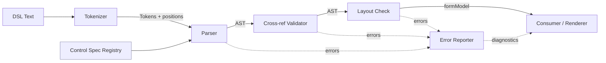
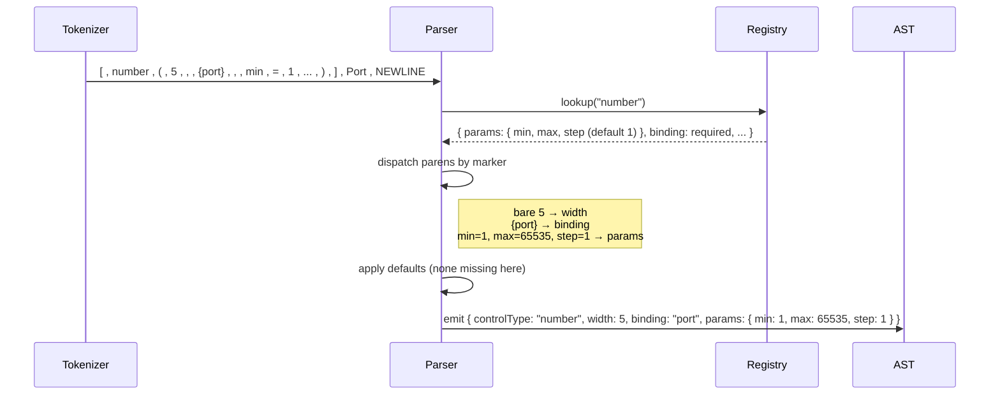

# Architecture

How a DSL string becomes a normalised form model (AST). The parser
does not know any control type by name; it knows only the *shape* of
a control declaration. The vocabulary lives in a control spec the
consumer hands in. That separation is the central architectural
decision.

---

## 1. Pipeline



The parser depends on the registry the same way it depends on the
token stream. Both are inputs. There are no hard-coded type names in
the parser.

The post-parse pipeline is two passes back-to-back. Cross-reference
validation (`src/parser/validate.js`) resolves `#tooltip` and
`#optionSource` names, checks binding policies (function bindings
require a read-only control), and refuses dangling references.
Layout check (`src/parser/layout-check.js`) sums each row's control
widths against the model's `columns` value and raises
`INVALID_LAYOUT` when a row overflows. The two passes ride the same
AST and report into the same error reporter; they're separate boxes
in the diagram so a reader can see where each diagnostic comes
from.

---

## 2. Components

| Component | Input | Output | Responsibility |
|---|---|---|---|
| **Tokenizer** | DSL text (string) | Token stream with source positions | Lex characters into tokens; collapse newlines inside `[...]`/`(...)`; preserve indent for line-based grammar |
| **Control Spec Registry** | Default spec + consumer extensions | Queryable lookup | Per-type policy (binding / width / optionsRef rules), per-param defaults, type-coercion rules |
| **Parser** | Token stream + registry | AST (formModel) + diagnostics | Walk tokens, dispatch parameters by marker, apply spec defaults, emit AST nodes |
| **Cross-ref Validator** | AST + registry | Validated AST + diagnostics | Cross-reference resolution (`#optName` → declared source), binding-policy checks (function bindings → read-only), reference checks (tooltips). Lives in `src/parser/validate.js`. |
| **Layout Check** | AST | Validated AST + diagnostics | Sums each row's control widths against the model's `columns` value; raises `INVALID_LAYOUT` when a row overflows. Lives in `src/parser/layout-check.js`. |
| **Error Reporter** | Errors with source positions | Diagnostic list | Format, accumulate, surface to consumer |
| **Façade (`TextFormBuilder`)** | Options bag | Public methods | Wire the components; expose `parse()`, `process()`, `validateSchema()`, `registerControl()` to consumers |

The two post-parse passes run back-to-back over the AST. Cross-ref
validation runs first (cheap; rejects dangling references before
the layout pass walks the same tree). Layout check follows. Either
can fail without preventing the other from reporting diagnostics
into the same error reporter, so a single bad form can surface
multiple distinct issues in one parse.

---

## 3. Data flow for a single control

End-to-end for `[number(5,{port},min=1,max=65535,step=1)] Port`:



If the user writes `[number(5,{port},max=65535)] Port`, the parser
still emits `step: 1` because the registry says `step` defaults
to `1`.

---

## 4. AST shape

The AST is the contract between the parser and every consumer. Once
published, changes to it are breaking.

### Top level

```js
{
  version: 1,
  columns: 20,
  optionSources: { /* see below */ },
  tooltips:      { /* string -> TextFragment[] */ },
  colors:        { /* string -> '#RRGGBB' */ },
  namedText:     { /* string -> TextFragment[] */ },
  namedObjects:  { /* string -> object */ },
  root: { /* container node */ },
  __properties:  { /* string -> { type, default } } */ }    // present after process(), or after a __properties block
}
```

| Field | Type | Notes |
|---|---|---|
| `version` | integer | AST schema version. Bump on breaking shape changes. |
| `columns` | integer | Global grid width. From `columns: N`. |
| `optionSources` | object<string, Source> | Named registry of `#name` references. |
| `tooltips` | object<string, TextFragment[]> | Named tooltip texts as fragment arrays. |
| `colors` | object<string, '#RRGGBB'> | Named colors used by decorator `:name` references. |
| `namedText` | object<string, TextFragment[]> | Named text bodies declared at the top level (`name = "..."` or `` name = `decorated...` ``). Resolved into fragments by phase 2; consumed by `contentRef` and inline `#name` references. |
| `namedObjects` | object<string, object> | Named-object literals declared at the top level (`name = { key: value, ... }`). Each object holds a flat property bag (see "Named-object body rule" below). Consumed by option-source value lists via `#name`. The primary-key marker (`!fieldName` in source) is parser-internal metadata and is not part of the public AST surface. |
| `root` | ContainerNode | Entry point of the form tree. |
| `__properties` | object<string, {type,default}> &#124; null | Sink-property dictionary. Either supplied directly via a `__properties = { ... }` block in the DSL, or attached by `process()` after a successful `parse()`. |

`__properties` has two ways in:

- The DSL declares `__properties = [ "name" = { type: "string", default: "" }, ... ]` at the top level, which `parsePropertiesBlock` reads. The dictionary appears on the AST as soon as `parse()` returns.
- The consumer calls `builder.process()`. `process()` runs `parse()`, then merges the form's discovered bindings into the dictionary that came back from parse (or starts from `{}` if the source had no block). The merge follows three rules: (a) entries already in the declared block survive; (b) a discovered binding whose name isn't in the block is added; (c) when both sides describe the same name, the discovered type wins on a type mismatch and an `init=` literal wins on a default mismatch. Each overwrite is recorded on `payload.__propertyChanges` (non-enumerable so JSON dumps stay clean) and as a human-readable string in `result.messages`. The merged dict is what the consumer writes back to source for a stable round-trip.

A note on the brace shapes. The outer block uses `[ ... ]` and `key = value` (square brackets, equals sign). Each inner entry uses `{ type: ..., default: ... }` with a colon (curly braces, colons). The two layers reuse JavaScript-shaped punctuation so the source reads naturally — the outer is "an array of named entries" and the inner is "an object with type + default fields." Mixing them up (`{ "name" = ... }` or `[ type: ... ]`) raises a `PARSE_ERROR` at parse time.

A note on `type` strings. The parser accepts any string for the `type` field on a `__properties` entry (it does not pin to `int|float|bool|string|string[]`). That is intentional. A sink consumer can declare its own type vocabulary (a custom `"uuid"` or `"durationSeconds"` type, for example) and the parser does not stand in the way. Validation against a specific list is the sink's job, not the parser's. The four-value `ALLOWED_DATA_TYPES` constant is for the universal `__dataType=` override on a control, where the parser does need to know how to coerce the value.

A note on `default` values. When `type` is one of the five known names (`int`, `float`, `bool`, `string`, `string[]`), the parser validates that `default` matches the JS shape: an `int` default must be an integer, a `string[]` default must be an array of strings, etc. A mismatch raises `PARSE_ERROR` at parse time so a typo like `{ type: "int", default: "abc" }` doesn't ride out and turn into stable round-trip churn (the merge's JSON-equality compare would otherwise re-report a diff on every parse). For custom types outside the five known names, the parser leaves `default` alone — the consumer's vocabulary is the consumer's contract.

A note on `__properties`. It is what a consumer wants hydrated on the AST: a sink author calls `process()` so the dictionary is attached as a regular enumerable field, ready to read or render. Parser-internal metadata (the primary-key marker on a named-object, for example) is stored on non-enumerable fields and is not part of the public AST. Consumers do not read those directly.

### Named-object body rule (v1)

Named-object bodies are flat property bags. Values are scalars only: strings, integers, floats, dates, `true`, `false`, or `null`. Bare identifiers other than the three keyword forms (`true` / `false` / `null`) are not accepted; quote your strings explicitly. Inline `#name` references are not accepted in body values.

Cross-references between named entities happen in one place only: option-source value lists. Keeping references confined to that one shape gives the AST a clean rule (named-object bodies are always flat) and avoids the cycle-detection burden a graph-of-objects shape would add.

**OK — references inside an option-source value list:**

```dsl
audit = { !name: "audit", color: "yellow" }
trace = { !name: "trace", color: "gray"   }
info  = { !name: "info",  color: "white"  }

# Option-source value list assembles the cross-references.
levels = [#audit, #trace, #info] -> {chosenLevels}
```

The parser stores each `#name` as a placeholder during phase 1 and resolves it to the actual object during phase 2 (see `rewrite-fragments.js`). The consumer reading `model.optionSources.levels.values` gets resolved scalars / objects, never placeholders.

**OK — flat-scalar bodies:**

```dsl
yellowSwatch = { hex: "#FFD700", label: "Sunburst", contrast: "dark", priority: 3, active: true }
```

Every value here is a scalar. No nesting, no `#name`. The body parses cleanly.

**Breaks — `#name` in a body value:**

```dsl
yellowSwatch = { hex: "#FFD700" }
audit = { !name: "audit", color: #yellowSwatch }
#                                  ^^^^^^^^^^^
# PARSE_ERROR: parseObjectValue does not accept HASH_IDENT in v1.
# To get the same effect, declare both as named objects and assemble
# the cross-reference in an option-source value list:
#
#   yellowSwatch = { hex: "#FFD700" }
#   audit        = { !name: "audit", color: "yellow" }
#   palette      = [#yellowSwatch, #audit] -> {paletteEntries}
```

**Breaks — bare identifier in value position:**

```dsl
audit = { !name: audit, color: yellow }
#                ^^^^^         ^^^^^^
# PARSE_ERROR: bare identifiers other than true/false/null are not
# allowed as values. Quote them: { !name: "audit", color: "yellow" }
```

**Breaks — nested object body:**

```dsl
audit = { !name: "audit", display: { fg: "white", bg: "red" } }
#                                  ^
# PARSE_ERROR: parseObjectValue does not recurse into another LCURLY.
# Flatten the field names: { !name: "audit", fg: "white", bg: "red" }
# or split into two named objects and reference one from an
# option-source list.
```

### TextFragment

```js
{ kind: 'text',     text: string,  style?: TextStyle }
{ kind: 'binding',  path: string,  style?: TextStyle }
{ kind: 'function', name: string,  style?: TextStyle }
```

`path` is always a single dotted string (`'a.b.c'`), not an array of
segments. The parser joins segments before emitting the fragment so
consumers can compare paths with simple string equality. The same
convention applies to `ControlNode.binding`. A consumer that needs
to walk segments calls `path.split('.')` itself.

These are the only fragment shapes a consumer ever sees. The parser uses a fourth internal `ref` fragment during phase 1 to mark `#name` references it hasn't resolved yet, but phase 2 either swaps every `ref` for the resolved named-text body or throws `INVALID_REF`. No `ref` fragment survives to the AST a consumer reads.

```js
TextStyle = {
  bold?:          boolean,
  italic?:        boolean,
  underline?:     boolean,
  strikethrough?: boolean,
  sizeStep?:      number,                      // ..., -2, -1, +1, +2 ...
  fg?:            { name, resolved },          // resolved: '#RRGGBB' or null
  bg?:            { name, resolved }
}
```

`fg.name` and `bg.name` are non-null when a decorator wrote `:name`;
`resolved` is the hex value if the name was found in the colors
block, or `null` if the renderer / compiler is expected to resolve
it. For direct hex codes (`#RRGGBB`), `name` is null and `resolved`
carries the value.

### OptionSource

```js
{
  type: 'static' | 'dynamic',
  // For type === 'static': the resolved value list. Each entry is a
  // primitive scalar (string / number / boolean / null / ISO date
  // string) or a resolved named-object body. A `#name` reference in
  // the source list is resolved during phase 2 to the actual object,
  // so consumers never see {__ref:'name'} placeholders.
  values: Array<string | number | boolean | null | object> | undefined,
  path: string | undefined,       // present when type === 'dynamic'
  bindings: string[],             // each `-> {binding}` adds one entry; empty when none declared
  binding: string | null          // back-compat shim: bindings[0] ?? null
}
```

A static source with `["S","M","L"] -> {sizeA} -> {sizeB}` produces
`bindings: ['sizeA', 'sizeB']`. The legacy `binding` field points at
the first entry so older readers keep working.

A static source can also reference named objects in its value
list: `users = [#alice, #bob, #carol]` produces a `values` list of
three resolved object bodies (plain dictionaries of the keys each
named object declared). Consumers walking `values` should expect a
mix of scalars and objects when a form uses `#name` references in
the same list as literals.

The `-> {ident}` clause is only accepted on **static** sources. A
dynamic source (`name = {dataPath}`) always emits `bindings: []`
and `binding: null`. Consumers that need to know which data field
holds the picked value should drive that off the control's own
`binding` field, not the source's binding list.

A dynamic source's `path` can be a function reference instead of a
data path: `levels = {@loadLevels}` parses as `type: 'dynamic'`,
`path: '@loadLevels'`. The renderer resolves the function against
its function registry at form-init time and uses the returned
array as the option list. Consumers walking `path` should check
the leading `@` before splitting on `.`.

### ContainerNode

```js
{
  nodeKind: 'container' | 'repeater' | 'listManager',
  collapsible: boolean,
  title:       TextFragment[],          // text slot 1, populated in phase 2
  description: TextFragment[],          // text slot 2, populated in phase 2
  tooltipRef:  string | null,           // `tt="key"` parameter; resolves to a model.tooltips entry. Same surface as ControlNode.tooltipRef.
  label:       TextFragment[],          // trailing text after the closing ], populated in phase 2
  headerControls: ControlNode[],        // 0..N; each one a [control(...)] before the label
  panels: PanelNode[] | null,           // mutually exclusive with rows
  rows: RowNode[] | null,               // mutually exclusive with panels
  arrayBinding: string | null,          // present for repeater / listManager
  itemMin: integer | null,              // repeater
  itemMax: integer | null,              // repeater
  when: string | null,                  // raw expression text
  whenAst: object | null,               // pre-parsed expression
  loc: SourceLoc

  // listManager-only fields. These exist on every container shape
  // (the parser initialises them on every node) but only listManager
  // populates them with non-default values. Renderers should ignore
  // them on container / repeater nodes.
  search:    boolean,                   // false on every kind unless listManager set it
  filter:    string | null,             // null on every kind unless listManager set filter="x"; renderers may fall back to 'name' as a convention
  draggable: boolean,                   // false on every kind unless listManager set it
  addLabel:  string | null,             // null on every kind unless listManager set it
  commit:    { kind: 'function', name: string } | null,
  excludedRef: string | null,           // null on every kind unless listManager set excluded=#name
  minHeight: string | null,             // CSS length, e.g. "300px"
  maxHeight: string | null              // CSS length; legacy `height=` aliases this
}
```

`title`, `description`, and `label` start as empty arrays in phase 1
and get filled by `rewrite-fragments.js` in phase 2 once the colors
map is complete. A container that wrote a literal title in source
(`[container("Setup")]`) sees that text become a `TextFragment[]`
on the node, not a binding string.

Containers and controls share one tooltip surface: the `tt="key"`
parameter, which sets `tooltipRef` and resolves to an entry in the
top-level `tooltips` map at validate time. There is no inline
`tooltip="..."` form; the `tooltips` block is the single place
tooltip text is authored.

A container has either `rows` or `panels`, never both. The other
slot is `null`. The validator rejects any AST that sets both.

`headerControls` is an array. Multiple controls can appear in a
collapsible header, including informational ones:

```dsl
[>container(panels=[1:8,2:12])] [toggle(3,{enabled})] [label(5,style=note)] Rolling Log Configuration
```

After the container's `]`, the parser consumes zero or more
`[control(...)]` declarations and then takes the rest of the line
as the container's label.

`listManager` adds shape-specific fields (`search`, `filter`,
`draggable`, `addLabel`, `commit`, `excludedRef`, `minHeight`,
`maxHeight`) that the renderer reads when present.

A container's parentheses accept at most two text slots:
the first becomes `title`, the second becomes `description`. A
text slot is a bare string, a `{binding}` reference, or a `#name`
reference; the cap counts all three shapes equally so an author
can't sneak past it by mixing forms. A third text slot raises
`PARSE_ERROR` ("Too many text slots in container declaration").
Authors who need richer per-slot formatting can mix decorated
strings with `{binding}` and `#name` references inside the same
slot, which expands into a `TextFragment[]` array. The two-slot
ceiling keeps the AST shape predictable for renderers; further
free-form text belongs in named-text bodies.

### RowNode

```js
{
  nodeKind: 'row',
  controls: Array<ControlNode | ContainerNode | RepeaterNode | ListManagerNode>,
  loc: SourceLoc
}
```

`controls` mixes inline controls and nested containers, the same way
an HTML `<div>` mixes inputs and child sections. A row that begins
with controls and ends with a `[container(...)]` reads as "render
these controls, then drop a nested block here." The renderer
discriminates by `nodeKind`.

### ControlNode

```js
{
  nodeKind: 'control',
  controlType: string,           // 'number', 'textfield', or any user-registered type
  width: integer | null,         // null for controls whose policy makes width optional with no default
  binding: string | null,        // null for label; '@fnName' for function bindings
  bindingType: string | null,    // explicit `:type` from `{name:type}`; null if absent
  dataType: string | null,       // null unless source declared `__dataType=`; when set, one of int|float|bool|string. The per-control fallback (DEFAULT_DATA_TYPE_BY_CONTROL) is consulted at process() time, not at parse, so this field is null on most controls.
  optionsSource: string | null,  // `#name` reference into model.optionSources
  contentRef: string | null,     // `#name` reference into model.namedText (label / display only)
  params: { [key: string]: any },// type-coerced values + defaults from registry
  secret: boolean,               // from spec metadata
  readOnly: boolean,             // from spec metadata
  when: string | null,           // raw expression text
  whenAst: object | null,        // pre-parsed expression
  tooltipRef: string | null,     // hoisted from `tt=` param; cross-checks against tooltips map
  init: object | null,           // hoisted from `init=`; { kind:'literal'|'binding'|'function', ... }
  compute: object | null,        // hoisted from `compute=`; typically { kind:'function', name }
  explain: TextFragment[],       // collapsible help text below the control, populated in phase 2
  label: TextFragment[],         // trailing text after ] (or empty array if none)
  loc: SourceLoc
}
```

The five hoisted fields (`when`, `whenAst`, `tooltipRef`, `init`,
`compute`) start life as entries in `params` (the `__common` block
in the control spec declares them universal across every control
type), and are lifted out onto top-level fields after parsing so
renderers don't have to dig through `params` to find them. The
`explain` field rides the same hoist for the phase-2 fragment
rewrite. `bindingType` and `dataType` are the two ways a consumer
can override the property type the binding emits (the inline
`{name:type}` suffix and the universal `__dataType=` parameter).

`PanelNode.label` and `ContainerNode.label` are also `TextFragment[]`.
Plain text becomes a single fragment `[{ kind:'text', text:'...' }]`.

A `binding` that begins with `@` (e.g., `'@formatStatus'`) is a
function reference resolved at render time, not a data path. Function
bindings are only valid on read-only controls; the validator rejects
them on writeable types.

### SourceLoc

```js
{ line: integer, col: integer, length: integer }
```

Container, repeater, listManager, control, and row nodes all carry
`loc`. Panel nodes (the `panels=[1:8, 2:12]` shape) do not; they
carry `number`, `label`, `width`, and `rows`. A renderer that needs
to point back at a panel uses the parent container's `loc` plus the
panel `number`.

Runtime errors ("`#missingSource` not declared") can point back to
the DSL text by line and column.

### 4.1 AST versioning

`version: 1` is set by `createInitialFormModel()`. Bump rules:

- **Patch or minor**: added optional fields, new control types in
  the default spec, new param types.
- **Major**: renamed fields, removed fields, changed coercion
  behaviour, changed `nodeKind` discriminators.

Consumers that pin to `version: 1` see a stable shape until a major
bump.

---

## 5. Control spec contract

The registry is data, not code. It drives parser behavior entirely.

### Per-type entry

```js
{
  // Optional control-level policy. Defaults shown.
  binding:    'required' | 'forbidden',                  // default: 'required'
  width:      'required' | { default: integer },         // default: 'required'
  optionsRef: 'required' | 'allowed' | 'forbidden',      // default: 'forbidden'

  // Optional metadata flags the renderer can read.
  secret:        boolean,            // mask in DOM, redact in toJSON()
  readOnly:      boolean,            // render as a read-only display (e.g. `display`)
  bindingShape:  string,             // documentation-only hint, e.g. '{start,end}'

  // Per-param schema. Empty object means no type-specific config.
  params: {
    [paramName]: {
      type:    'string' | 'integer' | 'number' | 'boolean'
             | 'enum' | 'date' | 'expression' | 'init'
             | 'computeFunction' | 'textOrRef',
      values:  any[],                // for type: 'enum'
      default: any                   // omit for "no default; emit undefined"
    }
  }
}
```

### `__common` block

```js
{
  __common: {
    params: {
      when:       { type: 'expression', default: null },
      tt:         { type: 'string',     default: null },
      init:       { type: 'init',       default: null },
      compute:    { type: 'computeFunction', default: null },
      explain:    { type: 'textOrRef',  default: null },
      __dataType: { type: 'enum', values: ['int', 'float', 'bool', 'string'], default: null }
    }
  }
}
```

Every control gets `__common.params` merged into its own `params`.
The parser hoists `when` and `tt` out of the `params` bag onto
top-level fields (`when` / `whenAst` and `tooltipRef`) so consumers
don't have to dig through `params` for them.

### Coercion rules per `type`

| `type` | Accepts in DSL | AST value |
|---|---|---|
| `string` | `'literal'`, `"literal"` | string |
| `integer` | bare digits (`5`, `-3`) | integer |
| `number` | bare digits with optional decimal | float |
| `boolean` | `true`, `false` | boolean |
| `enum` | bare identifier or quoted string in `values[]` | matching value |
| `date` | `YYYY-MM-DD` bare, or quoted | ISO date string |
| `expression` | quoted string | raw string under `when`; pre-parsed AST under `whenAst` |
| `init` | literal, `{path}`, or `{@fn}` | structured init record |
| `computeFunction` | `{@fn}` only (literals and `{path}` rejected) | `{ kind: 'function', name: string }` |
| `textOrRef` | quoted string or `#name` ref | string or named-text reference |

`expression` values are parsed at parse time, not at render time.
The parser runs `parseWhen` once per `when=` and stores both the
raw source string (under `when`) and the parsed AST (under
`whenAst`). The render-time `evaluateWhen(source, data)` walks the
already-parsed AST against the data; consumers who want to call
`parseWhen` themselves (for example, a static analyser checking
field references against the form's bindings) read `when` directly.

The trade-off: parsing eagerly catches grammar errors at the same
time as the rest of the parse (the author sees the bad expression
in the same error report as the rest of the form, not at render
time in front of the end user) and lets the validator cross-check
identifiers against discovered bindings. The cost is a slightly
larger AST. The author-time error visibility wins; the size
difference is small in practice.

### 5.1 Reserved names

`container`, `repeater`, `listManager`, and `this` are reserved.
They cannot be used as control type names or option-source names.
`validateControlSpec` rejects any spec entry that uses one of them;
`isReserved(name)` is exported for callers that want to check before
calling `registerControl`.

### 5.2 The `width` field

`width` is either the string `'required'` (the parser demands a
bare integer at the front of the parens) or `{ default: <number> }`
(the integer is optional and defaults to the supplied value).
`validateControlSpec` rejects any other shape with an
`INVALID_SPEC` error. The `hidden` control uses
`width: { default: 0 }` so authors don't need to type a size for
something that never renders.

---

## 6. Extension model

Two ways to register a custom control type. Both write to the same
registry.

```js
// Declarative form. Use this when the spec is fixed at construction.
const builder = new TextFormBuilder({
  controlSpec: {
    ...defaultControlSpec,
    json: {
      params: {
        rows:   { type: 'integer', default: 8 },
        schema: { type: 'string' }
      }
    }
  },
  schemaText
});

// Imperative form. Use this for plugin-style registration.
const result = builder.registerControl('json', {
  params: {
    rows:   { type: 'integer', default: 8 },
    schema: { type: 'string' }
  }
});
if (result.error !== ERR.OK) {
  console.error('Registration failed:', result.messages);
}
```

`registerControl` validates the candidate spec eagerly and returns
a `TupleResponse`. A malformed registration leaves `controlSpec`
untouched and surfaces the error at the call site instead of on the
next `parse()`.

The parser does not gain a code path for `json`. It looks the type
up in the registry, validates parameters against the spec, applies
defaults, and emits a `ControlNode` with `controlType: 'json'`. The
consumer's renderer is responsible for what `json` actually means
visually.

---

## 7. Design decisions

| Decision | Why |
|---|---|
| Parser is type-agnostic | Adding a new control type is data, not a parser change. Lets consumers extend the DSL without forking. |
| Parens-only parameters | One uniform parameter slot, marker-disambiguated. No mixed positional/keyword surface. |
| Bracket-balanced multi-line | Newlines inside `[...]`/`(...)` are whitespace. No `\` continuation needed. |
| `when=` captured as raw string | Expression DSL is a distinct concern. Captures keep the parser small; evaluation is renderer-side. |
| Source positions on every node | Runtime errors point back to the DSL. Required for any human-edited config. |
| `version` on the AST | The AST is a contract. Future shape changes need a version bump consumers can pin to. |
| `__common` in the spec | `when=` applies to every control. Hoisting avoids repetition. |
| One container kind with `collapsible` flag | Container and `>container` are the same node with a boolean. `repeater` and `listManager` are separate `nodeKind`s because their rendering loops differ. |
| Container-parameter dispatch table | `CONTAINER_PARAM_HANDLERS` in `parse-containers.js` keeps the param vocabulary declarative; adding a parameter is one entry. |
| AST walks are not cached | Every helper that walks the AST re-walks from scratch on every invocation. No caching, no memoization, no `processFromAst(ast)` shortcut. The trust posture is "the result is honest because the walk is honest." See [docs/architecture-no-ast-caching.md](architecture-no-ast-caching.md) for the full rule and the reasoning. |

---

## 8. Lexical and parsing rules

### 8.1 Comments

Line-leading comments: `#` as the first non-whitespace character on
the line (any indent allowed); the tokenizer drops from `#` to
newline.

Trailing comments: a space before `#`, and `#` followed by a space
or end-of-line. The tokenizer's quote-aware scan respects strings,
so `#` inside `"..."` is text. The "space-before" rule keeps
`#optName` option references unambiguous (no space after `#`).

```dsl
# full-line comment
extChoices = ["log", "ndjson", "csv"] -> {logExtension}  # trailing OK
```

Block comments are not supported.

### 8.2 String literals

Both single and double quotes accept literals. Inside a quoted
string, the escape sequences `\\`, `\'`, `\"`, `\n`, and `\t` are
recognised; any other backslash sequence passes the next character
through literally. Multi-line strings are not supported.

### 8.3 Numeric literals

Decimal only. Negative numbers allowed with leading `-`. Hex,
underscore separators, and scientific notation are not accepted in
v1.

A leading-dot float like `.5` or `-.5` is a single `FLOAT` token
when the previous token isn't an identifier-path component (an
`IDENT`, `RBRACKET`, or `RPAREN`). So `step=.5` parses as a single
float, and `customer.name` still parses as `IDENT DOT IDENT`. The
fence keeps both forms unambiguous: `.` after an identifier is a
member-access; `.` before a digit at the start of a value position
is the start of a number.

A numeric literal is capped at 20 characters. That's well past
`Number.MAX_SAFE_INTEGER` (16 digits) and every legal float without
exponent. An input longer than the cap raises `LEX_ERROR` with a
focused "numeric literal too long" message instead of silently
overflowing to `Infinity` and contaminating downstream layout sums.

### 8.3a Top-level block syntax

`tooltips`, `colors`, and `__properties` are bracketed lists. Each
entry is `key = value`, comma-separated. A trailing comma before the
closing `]` is allowed.

Trailing commas are accepted in every bracketed comma-list the
grammar carries: top-level blocks, control parameters
(`[number(5,{x},min=0,max=10,)]`), panel specs
(`panels=[1:8,2:12,]`), option-source value lists, named-object
bodies, and `__properties` array defaults. Authors who maintain
forms via diff-friendly tooling get clean one-line additions
without the "remember to add a comma to the line above" friction.

```dsl
colors = [
    "primary"   = "#3498DB",
    "danger"    = "#E74C3C",
    "ok"        = "#2ECC71",
]

tooltips = [
    "exposure" = "How large the account can grow before extra approval is required.",
    "logKeyHelp" = "The encryption key used to seal the per-record envelope.",
]

__properties = [
    "port"     = { type: "int",    default: 8080 },
    "userName" = { type: "string", default: "" },
    "tags"     = { type: "string[]", default: ["a", "b"] },
]
```

The keys can be bare identifiers (no quotes needed) when they only
contain letters, digits, and underscores; quote them when they
contain dots, dashes, or other punctuation. The value side of each
entry is parsed by the block-specific helper (a hex string for
`colors`, a quoted text for `tooltips`, an object literal for
`__properties`).

A note on `__properties` value coercion. Inside an entry's
`{ type: ..., default: ... }`, only the three keyword identifiers
(`true`, `false`, `null`) are accepted bare. Any other identifier
must be quoted. So `default: barValue` raises `PARSE_ERROR`; write
`default: "barValue"` instead. The same rule applies inside an
array default (`default: [foo, bar]` raises; write
`default: ["foo", "bar"]`). The strict-quoting rule keeps a typo
like `default: tru` from silently landing as the string `"tru"`.

A note on bare date literals. The five known `__properties` types
are `int`, `float`, `bool`, `string`, and `string[]`. Bare date
literals (`default: 2026-01-01`) are NOT accepted as `__properties`
defaults — `parsePropertyValue` only takes STRING / INTEGER /
FLOAT / IDENT keywords / array-of-those. Quote them as a string
(`default: "2026-01-01"`) when authoring a date default.

Option-source value lists are different — `parseLiteralValue` does
accept bare DATE tokens, so `["2026-01-01", "2026-12-31"]` parses
the entries as DATE values inside the option source. The asymmetry
is deliberate: option sources name choices, and a date is a
reasonable choice; `__properties` describes a typed property
dictionary whose vocabulary is the five names above. A consumer
defining a custom `"date"` type in their own vocabulary writes
`{ type: "date", default: "2026-01-01" }` — the parser leaves
custom-vocabulary types alone (per the type-string note above).

### 8.4 Whitespace and indentation

Spaces only for indent. A tab character at indent position raises
`LEX_ERROR` with the message *"Tab in indentation; spaces only"*.
This avoids the mixed-indent class of bugs that bites Python
configs.

Inside `[...]` and `(...)` brackets the lexer treats newlines as
whitespace, so a single declaration can span lines without `\`
continuations.

The fold collapses a multi-physical-line declaration into a single
logical line whose offsets no longer match the editor's row /
column. The LineSplitter records a `breaks` map alongside the
folded content: each merged newline records the offset where the
next physical line starts, plus that line's number and starting
column. The LineTokenizer translates every emitted token's
position back through the map, so a `ParseError` raised on the
sixth physical line of a six-line container declaration carries
the physical `(line, col)` an editor can highlight. Tokens
additionally carry the merged-content offset (`pos`) for slicing —
label-text capture reads from the original input string by
offset, and translating physical coordinates back to a single
slice point would be ambiguous when whitespace collapsed across
the fold.

### 8.5 Encoding

UTF-8 input throughout. Identifiers (control type names, parameter
keys, binding names, named-text keys, color keys, tooltip keys,
property keys) are ASCII only and follow the regex
`^[A-Za-z_][A-Za-z0-9_]*`. String literals and label text accept
arbitrary Unicode.

So `[textfield(5,{customer_name})] Customer Name` works fine. So
does `[textfield(5,{name})] お客様の名前` (Unicode in the label
text). What does not work is a Unicode identifier such as
`[textfield(5,{año})]`, which raises `LEX_ERROR` on the `ñ`. If a
form needs Unicode in field names, the field name lives in a label
or in named-text; the binding identifier stays ASCII.

The Unicode-in-label rule has one mechanical caveat: the tokenizer
only skips non-ASCII characters when bracket depth is 0 (label
text sits after the closing `]` of a declaration). Inside `[...]`,
`(...)`, `{...}`, only ASCII is accepted, since the grammar there
expects identifiers and structural punctuation. This matches how
the parser sees the source: declarations are ASCII, labels are
arbitrary text.

Line endings: the tokenizer recognises `\n`, `\r`, `\r\n`, and
`\n\r` as line terminators (the last is rare but appears
occasionally from buggy producers). Each form counts as one
logical line break for source-position tracking.

---

## 9. Validation

A single post-parse pass over the AST handles every cross-reference
and policy check. It runs after phase-2 fragment rewriting, before
the AST is returned. Failures throw `ParseError` (caught by
`runParse` and converted to a `TupleResponse`).

### 9.1 Cross-references

Reference policy: every `#name` reference resolves at parse time
against names declared in the same .mmpform document. The only
externally-resolvable reference is `{@function}`, which the
consumer's renderer wires to a function registry at render time.
A `#name` typo is a parse-time error, not a runtime surprise.

The validator checks every `#name` site:

- `optionsSource` on every control must reference a declared
  `optionSources` entry.
- `tooltipRef` (`tt="key"` on a control or container) must reference
  a declared `tooltips` entry.
- `contentRef` (`#name` inside a `label` or `display` parens) must
  reference a declared `namedText` entry.
- `excludedRef` (`excluded=#name` on a `listManager`) must reference
  a declared `optionSources` entry.
- Inline `#name` references in container titles, descriptions, and
  panel labels resolve in phase 2 against `namedText`. A miss raises
  `INVALID_REF`.
- Inline `#name` inside an option-source value list resolves to a
  declared `namedObjects` entry. A miss raises `INVALID_REF`.

A miss raises `INVALID_REF` with the offending name and source
position. `{@function}` references are not validated here; they're
runtime concerns owned by the renderer.

### 9.2 Binding policy

- A `binding` that starts with `@` (function-reference form) is
  only valid on a control whose spec sets `readOnly: true` (today,
  `display`). The validator raises `INVALID_PARAM` otherwise.

### 9.3 Layout sums

A row's control widths must not exceed the form's `columns`
declaration. `layout-check.js` runs as a post-parse pass (invoked
from `run-parse.js` after `parse()` returns) and raises
`INVALID_LAYOUT` for any row whose widths sum past the declared
column count. The check is its own pass so the parser stays focused
on grammar; layout is a separate concern that runs only when the
AST is otherwise complete.

---

## 10. Module layout

```
src/
├── tuple-response.js              # TupleResponse + ParseError + ERR codes
├── control-spec.js                # defaultControlSpec + validateControlSpec + lookupType
├── tokenizer.js                   # text -> token stream (LineSplitter + LineTokenizer)
├── expression.js                  # parseWhen + evaluateWhen for `when=` text
├── interpolate.js                 # interpolate(text, data, fns) for tooltip text. Empty-text input returns ''.
├── text-fragment.js               # parseDecorated + renderFragments (TextFragment[] core). Empty-text input returns []. The two text helpers return different empty shapes on purpose: parseDecorated returns fragments, interpolate returns text.
├── placeholder.js                 # resolvePlaceholder shared core: one rule for {path} / {@fn} resolution, called by interpolate AND text-fragment.fragmentToText so the two surfaces share one trust story
├── string-literal.js              # readQuotedString + writeQuotedString — symmetric reader/writer; both refuse the same C0 / CR / DEL bytes so round-trip is honest
├── safe-keys.js                   # RESERVED_INTERNAL set + assertSafeObjectKey + safeGet + resolveSafePath — three lines of prototype-walking defence in one file. The exported RESERVED_OBJECT_KEYS is wrapped in a Proxy that throws TypeError on add/delete/clear, so a downstream tampering attempt cannot widen or narrow the rule at runtime.
├── text-form-builder.js           # public façade (TextFormBuilder)
├── render-preview.js              # ASCII visualisation of the AST
├── infer-schema.js                # scaffolds data shape from the AST
├── property-collector.js          # collectProperties / validateProperties / renderPropertiesBlock
├── parser.js                      # internal barrel: re-exports parse() + runParse() for in-package use
├── version-generated.js           # synced from package.json by scripts/sync-version.mjs
├── index.js                       # public re-exports (the npm package surface)
└── parser/
    ├── parse.js                   # top-level parse(input, spec) -> ast
    ├── state.js                   # createParserState (the shared context object)
    ├── binding-helpers.js         # parseBindingPath + collectLabel (cross-file shared)
    ├── parse-toplevel.js          # columns, option sources, named text, named objects
    ├── parse-blocks.js            # colors / tooltips / __properties blocks
    ├── parse-containers.js        # container, repeater, listManager, panels, rows
    ├── parse-controls.js          # [control(...)] declarations + per-param coercion
    ├── literal-types.js           # defaultMatchesType + describeValue — shared validator for __properties defaults AND inline init= literals
    ├── rewrite-fragments.js       # phase-2 text-to-TextFragment[] rewrite
    ├── validate.js                # cross-reference + binding-policy validation
    ├── run-parse.js               # validate-spec + parse + layout-check, returns TupleResponse
    ├── initial-model.js           # createInitialFormModel()
    ├── constants.js               # shared regexes (PANEL_RX, BARE_NAMED_TEXT_RX)
    └── layout-check.js            # row-width-sums-to-columns validator
```

`parse(input, spec)` is the orchestrator. It builds a `state` object,
walks the input line by line, dispatches each top-level line to the
right helper in `parse-toplevel.js` / `parse-blocks.js` /
`parse-containers.js`, runs phase-2 fragment rewriting, runs
validation, and returns the AST.

`parser.js` is an in-package barrel only. `text-form-builder.js`
imports `runParse` from it; the npm package's `exports` map does
not list it. Consumers reach `parse()` and `process()` through
`TextFormBuilder` rather than importing the parser directly.

Every public façade method that can fail returns a `TupleResponse`
(§12).

### 10.1 Why composition over inheritance or mixins

Every helper in `parser/parse-*.js` is a named function that takes
the `state` object as its first argument and the tokenizer (or the
line array) as its second. There's no `Parser` class. There's no
`this` to chase. There's no `Object.assign(Parser.prototype, ...)`
to follow.

The trade-off the project chose:

- **For:** Jump-to-definition lands on the actual file the
  function lives in. Stack traces show the source location of the
  function as written. There's no method-shadowing footgun (a
  duplicate function name in two files is a duplicate-export
  error, not a silent override). A future TypeScript migration
  doesn't need to declare a special interface listing every method
  added to a prototype.
- **Against:** Each helper signature carries the `state` parameter
  explicitly. Cross-file calls (e.g. `parseControlDecl` calling
  `parseContainerDecl`) are real ES module imports, which means
  the import graph has cycles. ES modules handle function-only
  cycles cleanly because the import binding resolves at call time
  rather than at module-load time, but the cycle is visible in the
  imports and a contributor needs to know that's expected.

For container parameters specifically, the dispatch table in
`parse-containers.js` (`CONTAINER_PARAM_HANDLERS`) is the preferred
extension point. A new `key={value}` parameter is one entry in the
table; `nodeKinds` constraints stay declarative instead of being
scattered through if / else conditions in the dispatcher.

---

## 11. Error model

The parser uses fail-fast error semantics. The first error stops
the parse, raises a `ParseError` carrying `code`, `line`, and
`col`, and `runParse` converts it to a `TupleResponse.fail(...)`.
There is no error-accumulation pass; tooling that needs all
diagnostics in one go (a live editor, for example) is a future
concern.

Successful parses can still carry warnings (e.g., unused option
source declared but never referenced). When that happens,
`error === ERR.OK`, `payload` is the AST, and `messages` is
non-empty.

---

## 12. TupleResponse

Every public façade method that can fail returns a
`TupleResponse`. The shape mirrors a Unix process result: a numeric
code plus a payload plus diagnostics. That gives the consumer one
branching point (`error === 0`) and a stable place to look for both
data and messages.

```js
export class TupleResponse {
  constructor({ error, payload, messages }) {
    this.error    = error;       // 0 on success, non-zero on failure
    this.payload  = payload;     // result on success, null on failure
    this.messages = messages;    // diagnostic strings (errors and warnings)
  }
}
```

### Error codes

```js
export const ERR = Object.freeze({
  OK:               0,
  LEX_ERROR:        1,   // tokenizer: bad character, unterminated string
  PARSE_ERROR:      2,   // grammar: unexpected token, unbalanced bracket
  UNKNOWN_TYPE:     3,   // control type not in registry
  INVALID_PARAM:    4,   // unknown key, wrong type, missing required
  INVALID_REF:      5,   // #optName not declared, tooltip ref unknown
  INVALID_LAYOUT:   6,   // row widths sum exceeds columns
  INVALID_SPEC:     7,   // control spec itself is malformed
  INTERNAL_ERROR:   8    // unexpected exception inside the parser
});
```

| Code | Name | When it fires |
|---|---|---|
| 0 | OK | Parse and validate succeeded. `messages` may carry warnings. |
| 1 | LEX_ERROR | Tokenizer couldn't read a character or string literal (includes tab-in-indent). |
| 2 | PARSE_ERROR | Grammar violation. Unexpected token, unbalanced bracket, missing required marker. |
| 3 | UNKNOWN_TYPE | A control's type name is not in the registry. |
| 4 | INVALID_PARAM | Parameter key unknown for the control, value couldn't coerce, or required param missing. Also fires for function bindings on writeable controls. |
| 5 | INVALID_REF | `#optName` references an undeclared option source, or a `tt=` reference points at an undeclared tooltip. |
| 6 | INVALID_LAYOUT | A row's control widths sum to more than `columns`. |
| 7 | INVALID_SPEC | The control spec passed to the builder doesn't match the spec contract (§5). Also fires for `registerControl()` rejections. |
| 8 | INTERNAL_ERROR | Unexpected exception inside the parser (a TypeError, a RangeError, anything that isn't a `ParseError`). The messages array carries the error name, message, and the first stack frame. The consumer never has to wrap `parse()` in try / catch; the failure modes always come back through the response envelope. |

### Consumer pattern

```js
import { ERR } from '@mmpworks/formbuilder-dsl';

const result = builder.parse();

if (result.error !== ERR.OK) {
  console.error(`Parse failed (code ${result.error}):`);
  for (const m of result.messages) console.error('  -', m);
  return;
}

// On success:
const ast = result.payload;
domBuilder.render(ast, componentsMap, sourceObject, targetElement);
```

### Message format

Each entry in `messages` carries enough context to point back to
the DSL:

```
"line 12, col 4: unknown control type 'numbr' (did you mean 'number'?)"
"line 18: row widths sum to 24, exceeds columns: 20"
```

Messages are plain strings. If consumers need structured
diagnostics later, a new shape can ship alongside without breaking
the `messages` array contract. Consumers should not parse strings.

### `TupleResponse.fail` accepts strings, arrays, or `Error` objects

The static `TupleResponse.fail(error, messages)` normalises whatever
the caller passes:

- A `string[]` is used as-is.
- A single string becomes `[string]`.
- An `Error` (or `ParseError`) is formatted as `"Name: message"`,
  with the stack trace appended on a second line when one is
  available. This keeps a useful trail when an exception leaks into
  `fail()` instead of a pre-formatted message string.
- Anything else is wrapped via `String(value)`.

The parser itself only ever passes pre-formatted strings; the Error
branch exists for consumers who write their own validators around
`TextFormBuilder` and want to forward their exceptions through the
same envelope.

---

## 13. Summary

The parser is a thin walker over a token stream that consults the
control spec for every type-specific decision. The spec is data,
the AST is data, and the parser is the only piece of code in
between. Adding a control type is adding an entry to the spec;
adding a container parameter is one entry in the dispatch table;
adding a public façade method that can fail returns a
`TupleResponse`.

That keeps three boundaries clean:

1. **Grammar boundary**: bracket / paren / marker rules, owned
   by the parser.
2. **Vocabulary boundary**: what types exist and what they
   accept, owned by the spec.
3. **Behaviour boundary**: what a type *does* visually, owned by
   the consumer's renderer.

Each boundary moves independently. The parser does not need to be
rebuilt to support a new control type, the spec does not need to be
rebuilt to retarget a different UI library, and the consumer does
not need to understand the grammar to add a new component.
